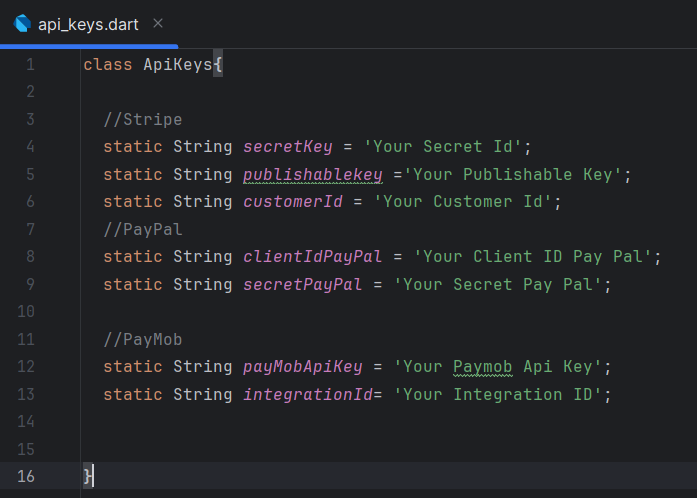

# 💳 Payment Methods App

A Flutter-based payment integration app that supports Stripe, PayPal, and Paymob for seamless transactions. Designed for secure and efficient online payments.

---

## ✨ Features
- Supports Stripe, PayPal, and Paymob payment gateways
- Secure and fast transactions
- Clean and maintainable architecture
- Smooth user experience

---

## 🛠️ Tech Stack
- **State Management:** Cubit
- **Dependency Injection:** GetIt
- **Navigation:** GoRouter
- **Architecture:** MVVM
- **Networking:** Dio
- **Payment Getways:** Stripe, PayPal, Paymob

---

## 🎥 Demo GIF

## Stripe:
  

## PayPal:
 

## Paymob:
 

---

## 📸 Screenshots

 

## Stripe:

## PayPal:
 

## Paymob:

  

---

## ⚙️ Requirements

To run this project, you must set up your API keys:
1-Add your Stripe, PayPal, and Paymob keys in API keys file.

---

