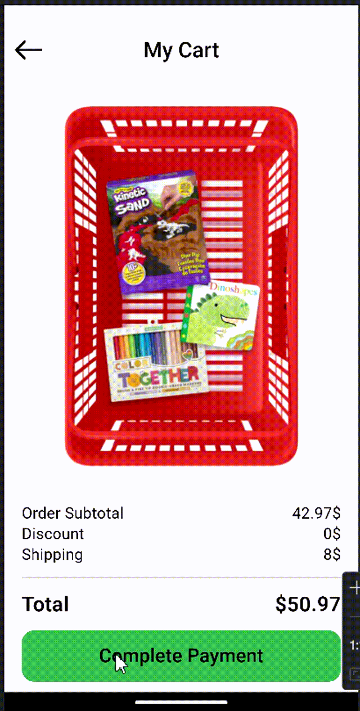
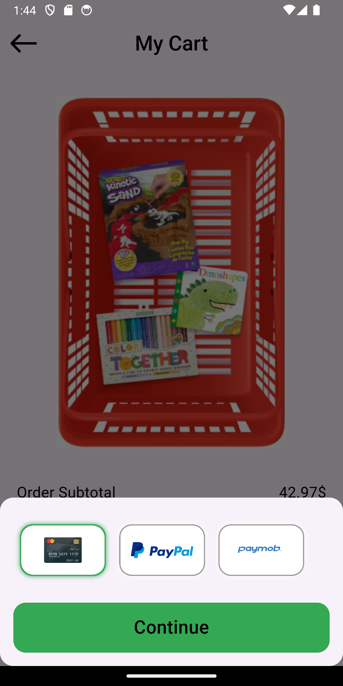
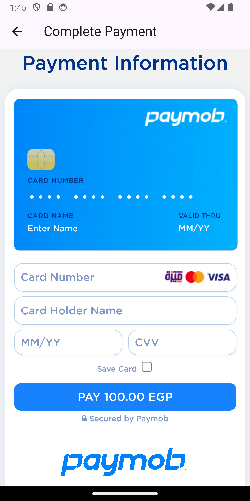
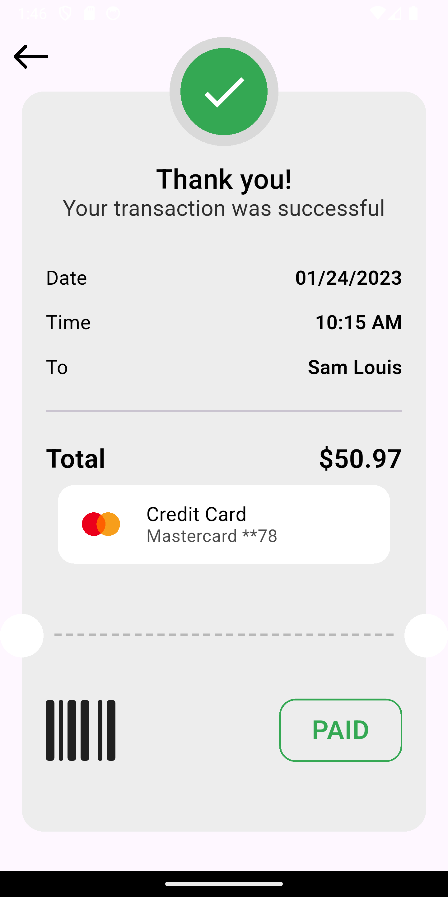

# 💳 Payment Methods App

A Flutter-based payment integration app that supports Stripe, PayPal, and Paymob for seamless transactions. Designed for secure and efficient online payments.

---

## ✨ Features
- Supports Stripe, PayPal, and Paymob payment gateways
- Secure and fast transactions
- Clean and maintainable architecture
- Smooth user experience

---

## 🛠️ Tech Stack
- **State Management:** Cubit
- **Dependency Injection:** GetIt
- **Navigation:** GoRouter
- **Architecture:** MVVM
- **Networking:** Dio
- **Payment Getways:** Stripe, PayPal, Paymob

---

## 🎥 Demo GIF
  
 
 

---

## 📸 Screenshots
   
   
    

---

